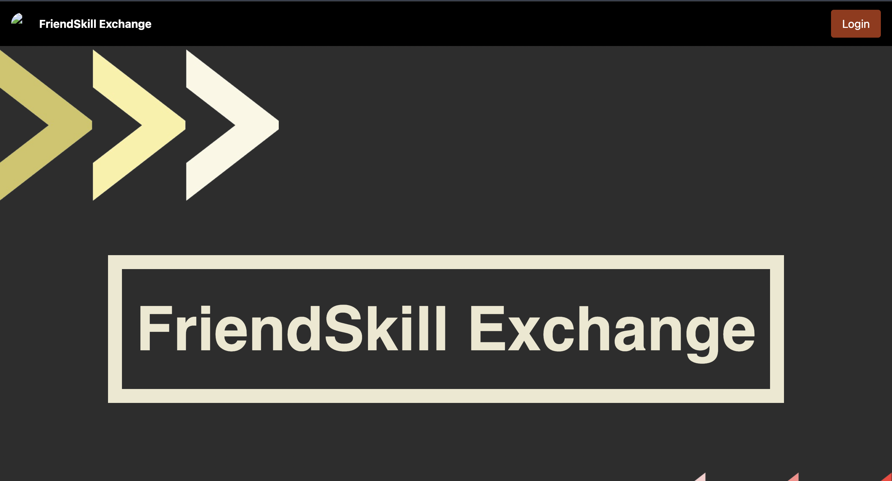
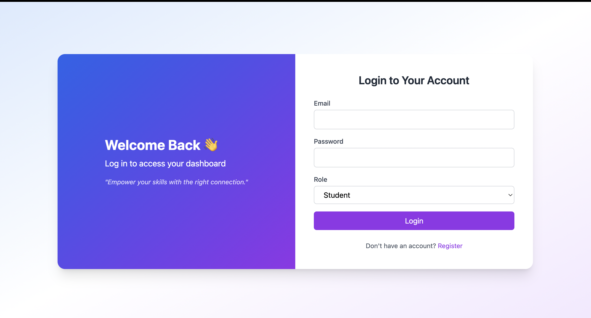
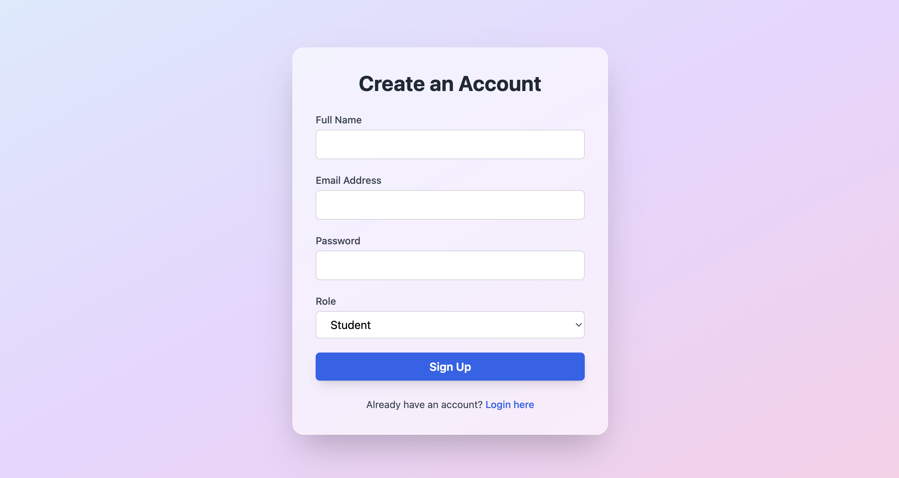
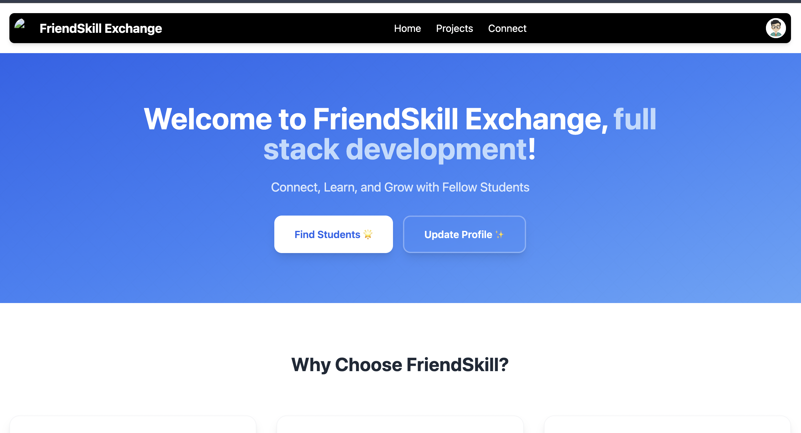
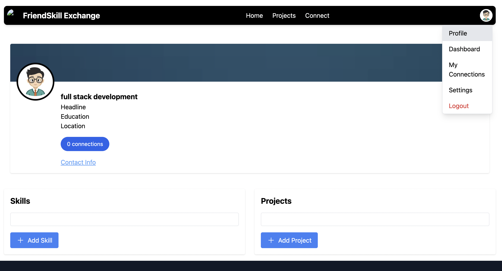

# Friends_Skill_Exchange


A collaborative platform designed to facilitate skill exchange between students and project sponsors. Connect, learn, share expertise, and grow together in a supportive community environment.

## Features

- **Learn from Experts**: Gain practical knowledge from experienced mentors in various fields.
- **Share Your Expertise**: Become a mentor and contribute to the community's growth.
- **Collaborative Environment**: Participate in group projects and engage in discussions.
- **Diverse Learning Opportunities**: Explore a wide range of topics and disciplines, completely free of cost.
- **Continuous Growth**: Support lifelong learning with ongoing opportunities for skill development.
- **Real-time Chat**: Communicate instantly with connections using integrated chat functionality.
- **Profile Management**: Create and manage detailed profiles for students and sponsors.
- **Connection Requests**: Send and manage connection requests to build your network.
- **Project Sponsorship**: Sponsors can post projects and connect with talented students.

## Tech Stack

### Backend
- **Node.js** - Runtime environment
- **Express.js** - Web application framework
- **MongoDB** - NoSQL database
- **Mongoose** - MongoDB object modeling
- **Socket.io** - Real-time communication
- **JWT** - JSON Web Tokens for authentication
- **bcrypt** - Password hashing
- **Multer** - File upload handling
- **Node-cron** - Task scheduling

### Frontend
- **React** - JavaScript library for building user interfaces
- **Tailwind CSS** - Utility-first CSS framework
- **Axios** - HTTP client for API requests
- **React Router** - Declarative routing for React
- **Socket.io-client** - Client-side library for real-time communication
- **Heroicons** - Beautiful hand-crafted SVG icons

## Installation

### Prerequisites
- Node.js (v14 or higher)
- MongoDB
- npm or yarn

### Backend Setup
1. Navigate to the backend directory:
   ```bash
   cd backend
   ```

2. Install dependencies:
   ```bash
   npm install
   ```

3. Create a `.env` file in the backend directory with the following variables:
   ```
   PORT=8000
   MONGODB_URI=your_mongodb_connection_string
   JWT_SECRET=your_jwt_secret
   DEV_URL=http://localhost:3000
   PROD_URL=your_production_url
   ```

4. Start the backend server:
   ```bash
   npm run dev
   ```

### Frontend Setup
1. Navigate to the frontend directory:
   ```bash
   cd frontend
   ```

2. Install dependencies:
   ```bash
   npm install
   ```

3. Start the development server:
   ```bash
   npm start
   ```

The application will be available at `http://localhost:3000`.

## ScreenShots
















## Usage

1. **Registration**: Create an account as either a student or a project sponsor.
2. **Profile Setup**: Complete your profile with relevant information and skills.
3. **Explore**: Browse through available connections and projects.
4. **Connect**: Send connection requests to potential mentors or collaborators.
5. **Chat**: Use the real-time chat feature to communicate with your connections.
6. **Learn & Share**: Participate in skill exchange activities and projects.

## API Endpoints

### Authentication
- `POST /v1/api/auth/login` - User login
- `POST /v1/api/auth/signup` - User registration
- `POST /v1/api/auth/logout` - User logout

### Profiles
- `GET /v1/api/student/profile` - Get student profile
- `PUT /v1/api/student/profile` - Update student profile
- `GET /v1/api/sponsor/profile` - Get sponsor profile
- `PUT /v1/api/sponsor/profile` - Update sponsor profile

### Connections
- `GET /v1/api/connection/requests` - Get connection requests
- `POST /v1/api/connection/send` - Send connection request
- `POST /v1/api/connection/accept` - Accept connection request
- `POST /v1/api/connection/reject` - Reject connection request

### Chat
- `GET /v1/api/chat/messages/:conversationId` - Get chat messages
- `POST /v1/api/chat/message` - Send a message

### Projects
- `GET /v1/api/projects` - Get all projects
- `POST /v1/api/projects` - Create a new project
- `PUT /v1/api/projects/:id` - Update a project
- `DELETE /v1/api/projects/:id` - Delete a project

## Contributing

We welcome contributions to FriendSkill Exchange! Please follow these steps:

1. Fork the repository
2. Create a new branch for your feature: `git checkout -b feature-name`
3. Make your changes and commit them: `git commit -m 'Add some feature'`
4. Push to the branch: `git push origin feature-name`
5. Submit a pull request

## License

This project is licensed under the ISC License.
